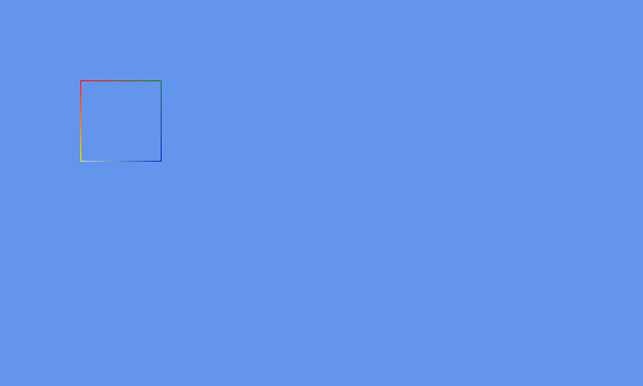
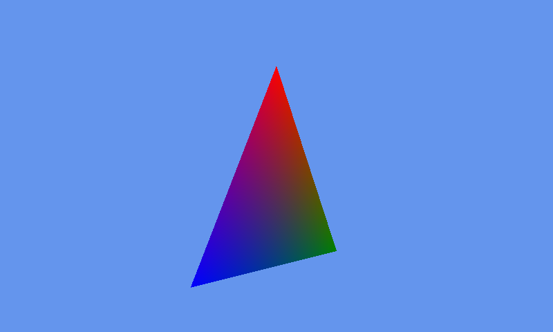
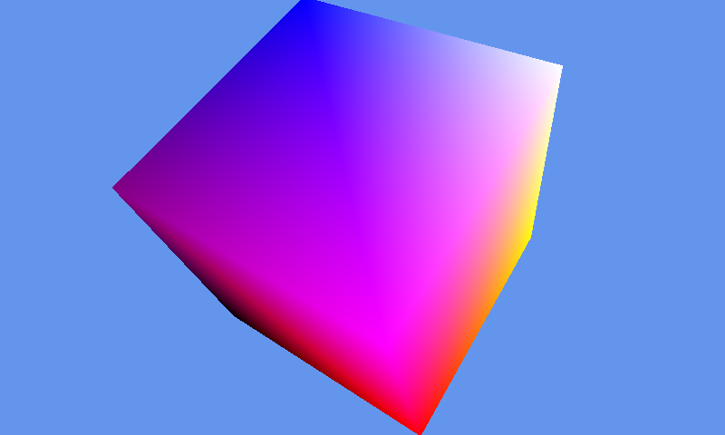
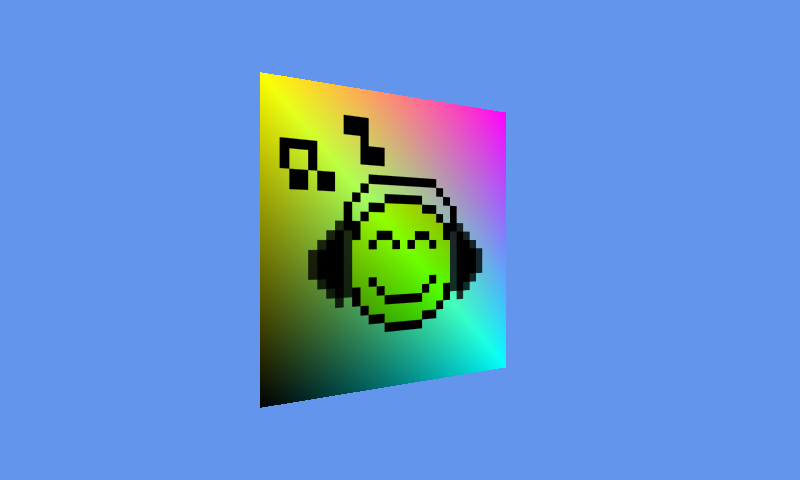

# MonoGameSamples
A few samples for MonoGame 3.3 (using Visual Studio 2013)

Here you will find really simple examples on how to get started with MonoGame, every sample is small and goes straight to the point; there are a few comments to put the emphasis on some subtleties.

(see notes at bottom)

**MonoGameSample2dOrtho** : draw 2d lines

**MonoGameSample3dTriangle** : draw a rotating 3d triangle

**MonoGameSample3dCube** : draw a rotating 3d cube using indices and clockwise ordering

**MonoGameSample3dTexturing** : draw a textured and tinted rectangle

and maybe a few more later ...

**Notes**:

- all these samples are done in 3D
- **it is recommended to follow them in the above order**, new concepts are commented the 1st time **but** not on subsequent samples. Basically if you are new to this kit, just follow them in order and you'll get a good overview on how to achieve basic things in less than an hour.
- **note the 3.3 version**, one of my motivation of writing this was the fact that my previous samples were not working anymore on this version; see this place as a personal reference as well as wiki for newbies. Should you get a blank screen on a newer version then it would mean something has changed internally (though there's a low probability as time passes on). For your convenience, I have put the 3.3 version installer in the repository.

Enjoy !